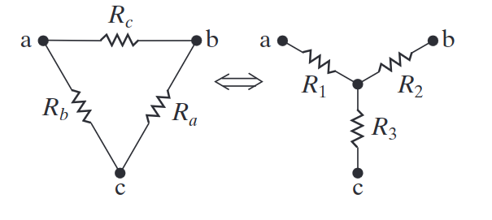
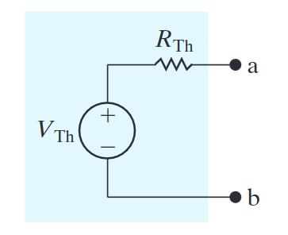

# Voltage, Current and Power
==Voltage== - The electrical potential between two points. It can also be thought of as the energy required to move the charge between those two points.
- Units Volts `V`.

==Current== - The rate of flow of electrically charge particles.
- Units Amps `A`.

==Power== - The rate at which energy its transferred. 
- Units watts `W`.
	
## Formulaic definition of Voltage, Current and Power
Voltage: 
$$
v = \frac{dw}{dq}
$$
Current:
$$
i = \frac{dq}{dt}
$$
Power:
$$
p = vi
$$

# Ohm's Law
Ohm's law relates the current and voltage through a resistor:
$$
v = iR
$$
It can also be written in terms of ==Conductance== `G`:
$$
G = \frac{1}{R}
$$

## Power Calculations using Ohm's Laws
$$
p = i^2 R 
$$
$$
p = \frac{v^2}{R}
$$

# Kirchhoff's Laws (KCL and KVL)
Kirchhoff's laws are on of the main ways to analyse circuits they state that:
- ==Kirchhoff's current law== - The sum of all the currents at a node must equal zero.
- ==Kirchhoff's voltage law== - The sum of the voltage around any closed path must equal zero.

# Resistors in Series and Parallel
It is possible to replace resistors in series and parallel with an equivalent resistor $R_{eq}$.
## Resistors in Series
$$
R_{\mathrm{eq}}=\sum_{i=1}^{k}R_{i}=R_{1}+R_{2}+\,\cdots\,+\,R_{k}
$$

## Resistors in Parallel
$$
{\frac{1}{R_{\mathrm{eq}}}}=\sum_{i=1}^{k}{\frac{1}{R_{i}}}={\frac{1}{R_{1}}}+{\frac{1}{R_{2}}}+\cdots+{\frac{1}{R_{k}}}
$$

# Divider Laws
## Voltage Divider Law
If you have a voltage flowing through resistors in series it is possible to calculate the voltage through each one using the following:
$$
v_1 = v_s \frac{R_1}{R_1 + R_2}
$$

If you have many resistors in series the voltage divider law still works:
$$
v_1 = v_s \frac{R_1}{R_{eq}}
$$

## Current Divider Law
If you have a known current flowing through resistors in parallel:
$$
i_1 = \frac{R_2}{R_1 + R_2} i_s
$$

If you have many resistors in parallel:
$$
i_j = \frac{R_{eq}}{R_j} i_s
$$

# Delta-to-Wye Equivalent Circuits
It is possible to transform a circuit in the delta configuration to the wye configuration and vice versa.

## Equations for Wye to delta
$$
\begin{align*}
\text{Equations for Wye to Delta:} \\
R_1 &= \frac{R_b \cdot R_c}{R_a + R_b + R_c} \\
R_2 &= \frac{R_a \cdot R_c }{R_a + R_b + R_c} \\
R_3 &= \frac{R_a \cdot R_b}{R_a + R_b + R_c} \\
\\
\text{Equations for Delta to Wye:} \\
R_a &= \frac{R_1 R_2 + R_2 R_3 + R_3 R_1}{R_1} \\
R_b &= \frac{R_1 R_2 + R_2 R_3 + R_3 R_1}{R_2} \\
R_c &= \frac{R_1 R_2 + R_2 R_3 + R_3 R_1}{R_3} \\
\end{align*}
$$

# Thevenin and Norton Equivalents
This a common method used to analyse circuits when you don't care about the behaviour of the inside of the circuit and just care about factors such as total power consumption and so on.

Thevenin Circuit Diagrams are depicted as:

Because of how simple the circuit is the relationship between the voltage and the current is just Ohm's law:
$$
i_{sc} = \frac{V_{Th}}{R_{Th}}
$$

## Determining a circuits Thevenin Equivalent
- First we must determine the voltage across the open-circuit.
- Then we must determine the current if the open circuit was a short circuit.
- It is also possible to calculate the ineternal resistance of the circuit from the perspective of the open circuit, which provides you with $R_{Th}$.
