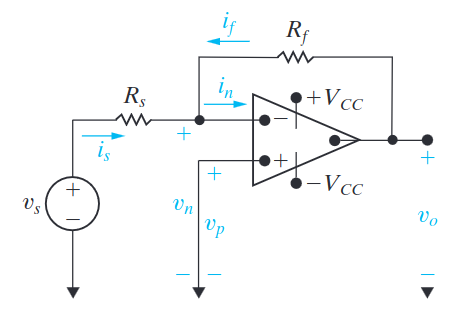
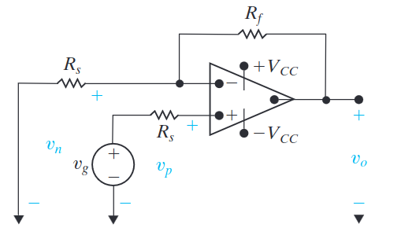
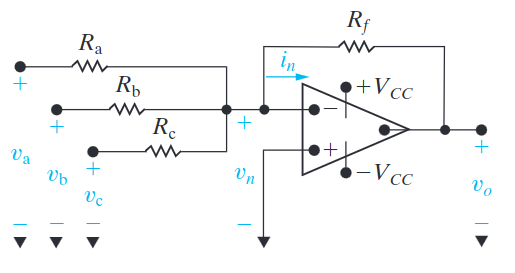
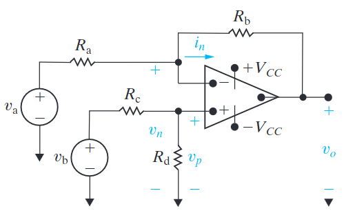

# Op-Amps Voltages and Currents
- The ==non-inverting input== terminal voltage is denoted as $v_p$
- The ==inverting input== terminal voltage is denoted as $v_n$
- The ==output== terminal voltage is denoted as $v_o$
- The positive and negative supply voltage are refereed to as $V_{CC}$ and $-V_{CC}$ respectively.
- The naming convention for currents is much the same as for voltages.

The most important equations describing the characteristics of an op-amp are:
The voltage relationship:
$$
v_p = v_n
$$
The current relationship:
$$
i_p = i_n = 0
$$

# The Inverting-Amplifier Circuit
The inverting Op-Amp can be used to invert the input voltage $v_s$.

The equation that describes the relationship of the input to output voltage is:
$$
v_o = \frac{-R_f}{R_s} v_s
$$

# The Non-inverting-Amplifier Circuit
The non-inverting-amplifier circuit can be used to boots to dampen the strength of an input voltage.

The relationship between $v_o$ and $v_g$ is:
$$
v_o = \frac{R_s + R_f}{R_s} v_g
$$

# The Summing-Amplifier Circuit
The summing-amplifier circuit can be used to sum voltages.

The equation that describes the relationship of the input voltages to the output voltage is:
$$
v_o = - (\frac{R_f}{R_a} v_a + \frac{R_f}{R_b} v_b + \frac{R_f}{R_c} v_c)
$$

# The Difference-Amplifier Circuit
The output of the The difference-amplifier circuit is equal to the different between the two input voltages.

The voltage relationship is:
$$
v_o = \frac{R_b}{R_a}(v_b - v_a)
$$
