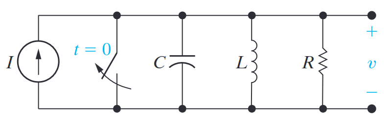

# General Solution of Second-Order Differential Equation
To solve second-order differential equations in $RLC$ circuits, we assume that the solution will be in exponential form.
$$
v = K e^{st}
$$
This assumption is the primary tool used in solving these circuits in conjunction with the classic methods of solving these equations.
*Note that $K$ is rarely written as the coefficient symbol changes if the circuit is overdamped, underdamped or critically damped to $A, B$ and $D$, respectively.*

## Example 
The easiest way to show how the general solution for second-order differential equations is with a worked example.

By performing nodal analysis on a parallel $RLC$ circuit with a voltage source $V$, we find:
$$
{\frac{d^{2}v}{d t^{2}}}+{\frac{1}{RC}}\,{\frac{d v}{d t}}+{\frac{v}{LC}}=0
$$
By using the general solution, we are able to solve this equation as follows:
$$
As^2 e^{st} + \frac{As}{RC}e^{st} + \frac{A}{LC}e^{st}  = 0
$$

$$
A e^{st} (s^2 + \frac{s}{RC} + \frac{1}{LC}) = 0
$$
By dividing by $Ae^{st}$ we are able to find the ==characteristic equation== of a parallel $RLC$ circuit:
$$
s^2 + \frac{s}{RC} + \frac{1}{LC} = 0
$$
We can then solve the characteristic equation to find ==characteristic roots== $s_1$ and $s_2$:
$$
s_{1}=-\frac{1}{2R C}+\sqrt{\left(\frac{1}{2R C}\right)^{2}-\frac{1}{L C}}
$$
$$
s_{2}=-\frac{1}{2R C} - \sqrt{\left(\frac{1}{2R C}\right)^{2}-\frac{1}{L C}}
$$
We can then substitute this back into the general solution to find the following:
$$
v = A_1e^{s_1t} +  A_2e^{s_2t} 
$$
*Note that we are ignoring the parts of the original equation other than the $A$ and the $e$ terms, as these are covered and encapsulated neatly in characteristic roots $s_1$ and $s_2$.*

Commonly, to determine $A_1$ and $A_2$, you will look to find 2 equations you know all the values for except for $A$. A common one is the initial condition of the circuit ($t = 0$).

# Parameters Parallel RLC Circuit
| Parameter | Terminology | Equation |
| --- | --- | ---| 
| $\alpha$ | Neper frequency | $\alpha = \frac{1}{2RC}$ |
|$\omega_0$ |Resonant radian frequency|$\omega_0 = \frac{1}{\sqrt{LC}}$|
| $s_1$ | Characteristic root | $s_1 = - \alpha + \sqrt{\alpha^2 - \omega_0^2}$ |
| $s_2$ | Characteristic root | $s_2 = - \alpha - \sqrt{\alpha^2 - \omega_0^2}$ |
All parameters have units of `rads/s`.

# Damping
==Damping== is vital in analysing systems that resonate (such as RLC circuits). 
It is possible to analyse damping by determining its ==damping factor==, which can be calculated as:
$$
\zeta = \frac{\alpha}{\omega_0}
$$
## Overdamped
If a circuit is overdamped, then it ==will not resonate==.
An $RLC$ circuit is overdamped when:
$$
\omega_o^2 < \alpha^2
$$
## Underdamped
If a circuit is underdamped, then it ==will resonate==.
An $RLC$ circuit is underdamped when:
$$
\omega_o^2 > \alpha^2
$$

Underdamped circuits have a property known as ==damped radian frequency== which is equal to:
$$
\omega_d = \sqrt{\omega_0^2 - \alpha^2}
$$

## Critically Damped
A critically damped circuit is just on the border of oscillation. This represents the ==minimum damping without oscillation==.
A circuit is critically damped if:
$$
\omega_o^2 = \alpha^2
$$

# Natural Response Parallel $RLC$ Damping 
Below are the general forms of the equations for a natural response parallel $RLC$ circuit.
## Overdamped Voltage Response
$$
v(t) = A_1e^{s_1t} +  A_2e^{s_2t} 
$$

## Underdamped Voltage Response
$$
v(t) = B_1 e^{- \alpha t} \text{cos}(\omega_d t) + B_2 e^{- \alpha t} \text{sin}(\omega_d t)
$$

## Critically damped Voltage Response
$$
v(t) = D_1 t e^{- \alpha t} + D_2 t e^{- \alpha t}
$$

# Step Response Parallel $RLC$ Damping 
These equations are found by performing nodal analysis across the parallel components. 

## Voltage Response
The voltage equations for the step response of a parallel $RLC$ circuit are the same as for the natural response, i.e.:
$$
v(t) = A_1e^{s_1t} +  A_2e^{s_2t} 
$$
$$
v(t) = B_1 e^{- \alpha t} \text{cos}(\omega_d t) + B_2 e^{- \alpha t} \text{sin}(\omega_d t)
$$
$$
v(t) = D_1 t e^{- \alpha t} + D_2 t e^{- \alpha t}
$$
*Note, however, you must be careful that you are accounting for the fact that there is a source at $t > 0$.*

## Overdamped Current Response
$$
i_L(t) = I + A^\prime_1e^{s_1t} +  A^\prime_2e^{s_2t} 
$$
*$I$ is the current source*

## Underdamped Current Response
$$
i_L(t) = I + B^\prime_1 e^{- \alpha t} \text{cos}(\omega_d t) + B_2^\prime e^{- \alpha t} \text{sin}(\omega_d t)
$$
*$I$ is the current source*

## Critically Damped Current Response
$$
i_L(t) = D^\prime_1 t e^{- \alpha t} + D^\prime_2 t e^{- \alpha t}
$$
*$I$ is the current source*

# The Natural and Step Response for Series $RLC$ Circuits
The methodology for analysing series circuits is the same as those used in parallel $RLC$ circuits.

## Characteristic equation
The characteristic equation is given as follows:
$$
s^2 + \frac{R}{L}s + \frac{1}{LC} = 0
$$

# Parameters Series RLC Circuit
| Parameter | Terminology | Equation |
| --- | --- | ---| 
| $\alpha$ | Neper frequency | $\alpha = \frac{R}{2L}$ |
|$\omega_0$ |Resonant radian frequency|$\omega_0 = \frac{1}{\sqrt{LC}}$|
| $s_1$ | Characteristic root | $s_1 = - \alpha + \sqrt{\alpha^2 - \omega_0^2}$ |
| $s_2$ | Characteristic root | $s_2 = - \alpha - \sqrt{\alpha^2 - \omega_0^2}$ |
All parameters have units of `rads/s`.

# Specific Equations for Series RLC Responses
## Current Response
$$
i(t) = A_1e^{s_1t} +  A_2e^{s_2t} \text{ (overdamped)}
$$
$$
i(t) = B_1 e^{- \alpha t} \text{cos}(\omega_d t) + B_2 e^{- \alpha t} \text{sin}(\omega_d t) \text{ (underdamped)}
$$
$$
i(t) = D_1 t e^{- \alpha t} + D_2 t e^{- \alpha t} \text{ (critically damped)}
$$

## Voltage Step Response
$$
v_C(t) = V_f +  A^\prime_1e^{s_1t} +  A^\prime_2e^{s_2t}  \text{ (overdamped)}
$$
$$
v_C(t) = V_f + B_1^\prime e^{- \alpha t} \text{cos}(\omega_d t) + B_2^\prime e^{- \alpha t} \text{sin}(\omega_d t) \text{ (underdamped)}
$$
$$
v_C(t) = V_f + D_1^\prime t e^{- \alpha t} + D_2^\prime t e^{- \alpha t} \text{ (critically damped)}
$$
