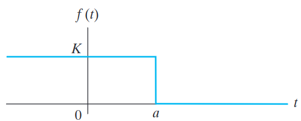
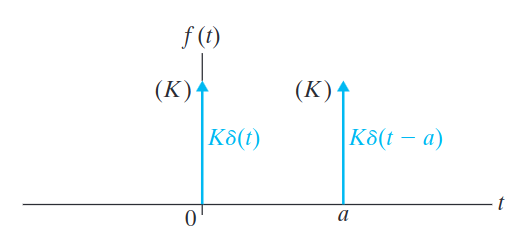
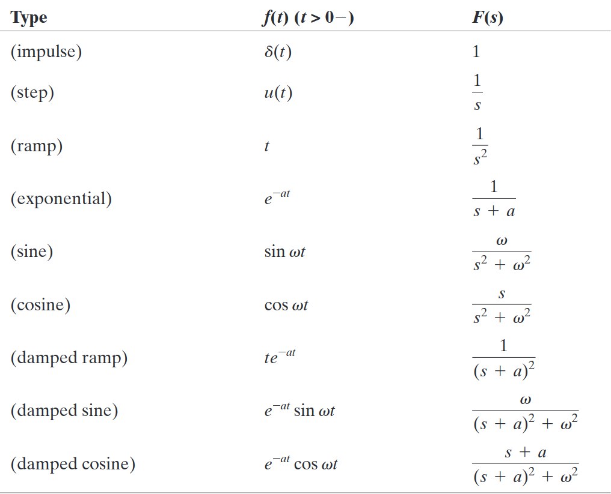
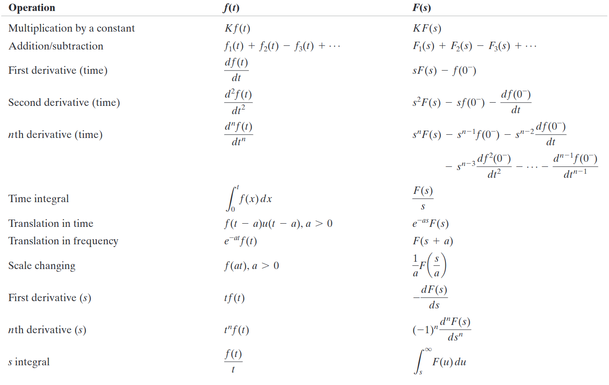
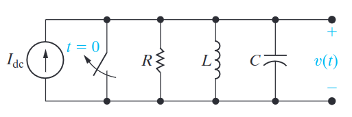

# The Laplace Transform
The Laplace transform is defined as the following mathematical operation:
$$
\mathcal{L}\{f(t)\} = \int^{\infin}_{0} f(t) e^{-st} dt
$$
Symbols of functions within the $s$-domain are given capital letters such as $F(s)$, $V(s)$ $I(s)$ and so on.
*The ==$s$-domain== is the term given for the name of functions that have undergone Laplace Transforms.*

## Why use the Laplace Transform?
The Laplace Transform is helpful as it allows us to avoid integrating complicated expressions making analyzing circuits very straightforward.

## Limitations of the Laplace Transform
It is important to note that ==not all functions== have a ==Laplace Transforms==. This is because functions with terms such as $t^t$ cannot be integrated into $\infin$ and, therefore, cannot represent within the $s$-domain. Also, as the lower limit of the integral is 0, the Laplace transform ==does not capture $t < 0$==. 
*Note that there are technically Laplace Transforms where $-\infin \ge t \ge \infin$, known as bilateral Laplace transforms, which are not covered in this subject.*

# The Step Function $u(t)$
The step function can be considered like a ==switch== for other functions. Its mathematical definition is:
$$
Ku(t-a) = 0, \quad t<a
$$
$$
Ku(t-a) = K, \quad t>a
$$
Where $K$ is an arbitrary function or constant.
*Note it is a way to represent piece-wise functions in a single equation.*

# The Impulse Function $\delta(t)$
The impulse function allows us to find the value of another function at a specific point in time while disregarding the rest of it. Mathematically it is defined as:
$$
\int^\infin_{-\infin} f(t) \delta(t - a) = f(a)
$$

The technical definition of the impulse step function is:
- The amplitude approaches infinity at a specific point $t = a$.
- The duration of the function approaches 0
- The area under the variable-parameter function is constant.

*Note that the mathematical definition of the impulse function can be represented in a myriad of different ways, such as $f(t) = \frac{K}{2 \in}e^{-|t|/\in} \quad \text{as} \in \rightarrow 0$.*

# Laplace Transform Table
Below is a breakdown of some of the most common Laplace Transforms. This allows us to transform functions to and from the $s$-domain without integrating anything.

# Operational Transforms
Operational transforms refer to how Laplace transformed functions respond to mathematical manipulation:

# Inverse Laplace Transforms
To perform inverse Laplace transforms, we can use the table of transforms to revert the function to the time domain. However, we often find what we are trying to convert is a fraction comprised of two polynomial expressions. To rectify this, we must perform ==partial fraction expansion== (see worked example).

# Laplace Transform Worked Example

For the above circuit, we can write the nodal equation as follows:
$$
\frac{v(t)}{R} + \frac{1}{L} \int^t_0 v(x) dx + C \frac{dv(t)}{dt} = I_{dc} u(t)
$$
*Note the addition of the step function to represent the switch being opened at $t=0$.*
By using the Laplace Transform Table, we find:
$$
\frac{V(s)}{R} + \frac{1}{L} \frac{V(s)}{s} + C [sV(s) = v(0^-)] = \frac{I_{dc}}{s}
$$
Rearranging for $V(s)$:
$$
V(s) = \frac{I_{dc}/C}{s^2 + (1/RC)s + (1/LC)}
$$
Now we can find the inverse Laplace transform of this function to find an expression for the voltage $v(t)$ within the time domain.

# Partial Fraction Expansion Worked Example
Often we will find that we have an expression that looks like this:
$$
V(s) = \frac{s+6}{s(s+3)(s+1)^2}
$$
*Note you may have to manipulate the numerator and/or the denominator using a technique such as the quadratic equation.*
Now we can expand out the fraction as:
$$
\frac{s+6}{s(s+3)(s+1)^2} = \frac{K_1}{s} + \frac{K_2}{s+3} + \frac{K_3}{(s+1)^2} + \frac{K_4}{(s+1)}
$$
*Note how we expand expressions such as $(s +1)^2$.*
To determine the coefficients of the equation ($K$), we multiply both sides of the equation by each root in turn and evaluate it. So as an example for $s = 0$:
$$
\frac{0+6}{(0+3)(0+1)^2} = K_1 = 2
$$
Repeating the process we find $K_1 = 2, K_2 = -0.25, K_3 = -2.5$ and $K_4 = -1.75$:
*Note there are [Online Partial Fraction Calculators](https://www.wolframalpha.com/calculators/partial-fraction-calculator) as well as tools such as MATLAB, which allow you to automate this process.*

## Inverse Laplace Transform
As we have determined the coefficients, we can express our original function as:
$$
V(s) = \frac{2}{s} - \frac{1}{4(s+3)} - \frac{5}{2(s+1)^2} - \frac{7}{4(s+1)}
$$
Now we can use the Inverse Laplace Transform table:
$$
v(t) = (2 - \frac{1}{4}e^{-3t} - \frac{5}{2} t e^{-t} - \frac{7}{4} e^{-t}) u(t)
$$
