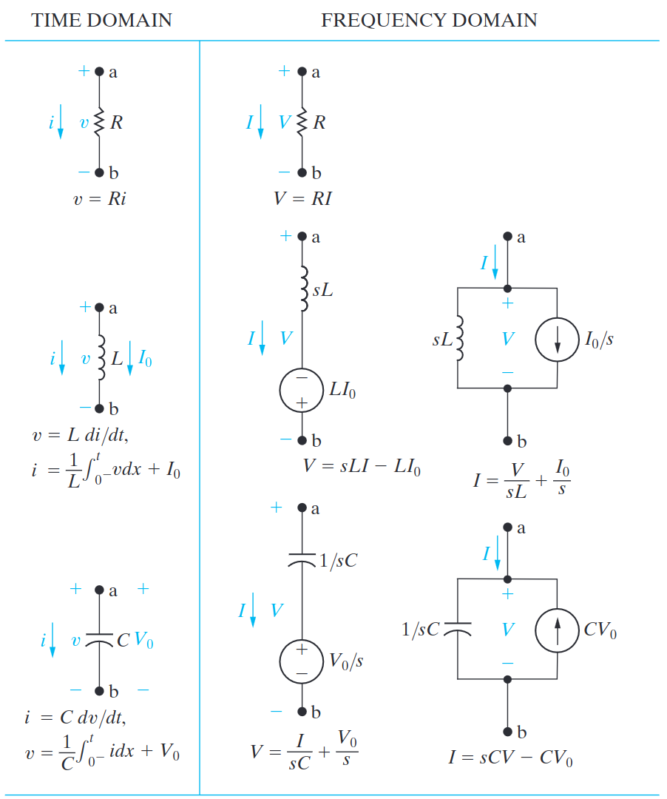

# Circuit Elements in the $s$ Domain
The Laplace Transform is helpful in circuit analysis as it allows you to bypass the process of integrating functions in the time domain.  

The $s$ domain transformation of circuit elements is best summarised in the following table:

*Note that current and voltage are represented with a capital letter ($V$ and $I$) within the $s$ domain.*

If there are no initial conditions in the circuit, all circuit elements are in the form $V = Z I$ (where $Z$ is the specific ==impedance== of the component). As all components are in this form, this makes ==KVL== and ==KCL== simple tools to employ.

# Zeroes and Poles
Often when analysing circuits within the $s$ domain, you will end up with an expression in the form:
$$
\frac{(s+Z_1) \times ... \times (s+Z_n)}{(s+P_1) \times ... \times (s+P_q)}
$$
- The ==zeroes== are the terms in which the numerator sums to zero.
- The ==poles== are the terms where the denominator equals zero.

*A way to remember which one is which is that when the numerator is equal to zero, the equation is zero; and as the denominator $\rightarrow$ $0$, the equation $\rightarrow$ $\pm \infin$, hence it is a pole.*

## Quadratic equation
Solving equations in the $s$ often will require using the quadratic formula:
$$
y = ax^2 + bx + c = 0
$$
$$
x = \frac{-b \pm \sqrt{b^2 - 4ac}}{2a}
$$

# Evaluating limits in the $s$ domain
It is possible to glean important information about the circuit without necessarily transforming the equations back into the time domain. This is done by looking at the limits of $s$.

## $s$ approaching $\infin$
$$
\lim_{t \rightarrow 0} f(t) = \lim_{s \rightarrow \infin}sF(s)
$$
## $s$ approaching 0
$$
\lim_{t \rightarrow \infin} f(t) = \lim_{s \rightarrow 0}sF(s)
$$

# The Transfer Function
The ==transfer function== is the ratio of the circuit's output to the circuit's input.
$$
H(s) = \frac{Y(s)}{X(s)}
$$
Where $Y(s)$ is the ==output== and $X(s)$ is the ==input==.
*Note that $H(s)$ should always be real.*

# Transfer Function and the Steady-State Sinusoidal Response
This method allows us to use the transfer function to determine the steady-state response of a circuit.
First remember that $x(t)$ is in the form:
$$
x(t) = A\text{cos}(\omega t + \phi)
$$
By manipulating the equation in the transfer function, we are able to relate the steady-state output as follows:
$$
y_{ss}(t) = A |H(j \omega)| cos [\omega t + \phi + \theta(\omega)]
$$
Note that $|H(j \omega)|$ is the ==magnitude== of the transfer function, and $\theta(\omega)$ is the ==phase angle== of the transfer function.

*Note this relationship is very straightforward as it's essentially the magnitude and the phase angles of $X(s) \times H(j \omega)$.*
