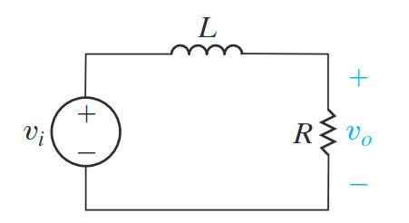
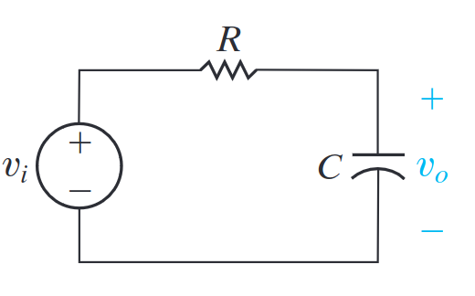
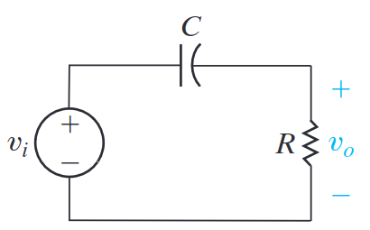
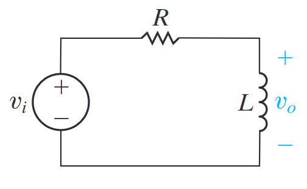
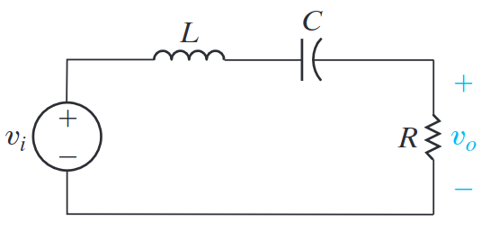
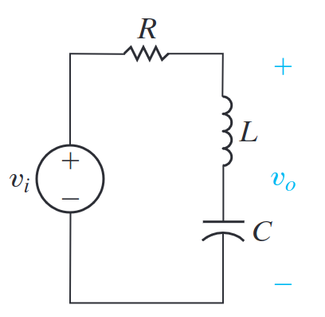

# Frequency Selective Circuit
As the name would suggest, ==Frequency Selective Circuits== are those that filter inputs based on their frequency. While in the following sections, the equations for the basic types of filters are provided, often determining these equations requires deriving them yourself. 

## Terminology
Below is a breakdown of the common terminology used when talking about filters:
- The ==pass-band== is the range of frequencies that are unfiltered.
- The ==stop-band== is the range of frequencies in which the output is severely diminished or removed.
- The ==cutoff frequency== ($\omega_c$) is the frequency that separates the pass-band and stopbands.
- ==Passive filters== are filters that are comprised entirely of passive circuit elements (no op-amps, for example).

## The Cutoff frequency 
The cutoff frequency $\omega_c$ is equal to:
$$
|H(j \omega)| = \frac{1}{\sqrt{2}} H_{max}
$$
$H_{max}$ is the maximum value of the magnitude of the transfer function.

*Note that this value is in a sense arbitrary, as $\frac{1}{\sqrt{2}}$ was selected as this is the point at which the power is half that of the original value.*

# Types of Frequency Selective Circuits
Below are the plots of the Mangintude, $|H(j \omega)|$ and phase, $\theta (j \omega)$ of the 4 frequency selective circuits. 

![TypesOfFrequencySelectiveCircuits.png]_resources/TypesOfFrequencySelectiveCircuits.png)

Where:
a) Low-pass filter - Stops frequencies above the cutoff frequency $\omega_c$
b) High-pass filter - Stops frequencies below the cutoff frequency $\omega_c$
c) Bandpass filter - Allows frequencies between $\omega_{c1}$ and $\omega_{c2}$ 
d) Bandreject filter - Stops frequencies between $\omega_{c1}$ and $\omega_{c2}$ 

*Note these graphs are not representative of the circuits' real-world behaviour but are the idealised behaviour.*

# Low-Pass Filters
## General Formula for the Transfer Function of First Order Low-pass Filters
$$
H(s) = \frac{K \omega_c}{s +\omega_c}
$$
*K is the ==Gain== of the filter, which is explained in depth in a later chapter. All the examples below have a scaling factor of 1.*

## Low-Pass Series $RL$ Circuit

*Intuitively, this makes sense since as you increase the frequency, the impedance across the inductor will become very large. Hence, the voltage signal across the resistor will become very small.*

### $RL$ Low-Pass Cutoff Frequency $\omega_c$
$$
\omega_c = \frac{R}{L}
$$

## Low-Pass Series $RC$ Circuit
The following $RC$ circuit creates a low pass filter. 

### $RC$ Low-Pass Cutoff Frequency $\omega_c$
Through a simple substitution into $|H(j \omega)|$ we derive that the cut-off frequency is:
$$
\omega_c = \frac{1}{RC}
$$

# High-Pass Filter
## General Formula for the Transfer Function of First Order High-pass Filters 
$$
H(s) = \frac{Ks}{s + \omega_c}
$$

## High-Pass Series $RC$ Circuit

### $RC$ High-Pass Cutoff Frequency $\omega_c$
$$
\omega_c = \frac{1}{RC}
$$

## High-Pass Series $RL$ Circuit 

### $RL$ High-Pass Cutoff Frequency $\omega_c$
$$
\omega_c = \frac{R}{L}
$$

# Bandpass Filter
A bandpass filter can be thought of as a low-pass and high-pass filter combined. This means that it also has two cutoff frequencies $\omega_{c1}$ and $\omega_{c2}$.

## General Bandpass Parameters
### Resonant Frequency
An important parameter in the analysis of the bandpass filter is the ==centre frequency== or ==resonant frequency==, ($\omega_o$). The resonant frequency is equal to:
$$
\omega_o = \sqrt{\omega_{c1} \omega_{c2}}
$$
*Note that $H_{max}$ occurs in a bandpass filter at $|H(j \omega_o)|$*

### Bandwidth
==Bandwidth== is the range of frequencies of the pass-band filter, denoted with $\beta$. As you would expect:
$$
\beta = \omega_{c2} - \omega_{c1}
$$

### Quality Factor
==quality factor==, $Q$,  is a measure of the width of the pass-band.
$$
Q = \frac{\omega_o}{\beta}
$$

## $RLC$ Bandpass Circuit Diagram

### Center frequency for $RLC$ Bandpass filter
$$
\omega_o = \sqrt{\frac{1}{LC}}
$$

### Cutoff frequency for $RLC$ Bandpass filter
$$
\omega_c = \frac{\pm R}{2L} + \sqrt{(\frac{R}{2L})^2 + (\frac{1}{LC})}
$$

### $RLC$ Bandpass Transfer function 
$$
H(s) = \frac{\beta s}{s^2 + \beta s + \omega_o^2}
$$

### $RLC$ Bandpass Neper Frequency $\alpha$
The Neper Frequency or resonant frequency of this bandpass filter is:
$$
\alpha = \frac{R}{2L} \text{rad/s}
$$
*More information in 'Natural / Step Response of $RLC$' circuits.*

### $RLC$ Bandpass Bandwidth Frequency $\beta$
Due to the relationship between the neper frequency and the resonate frequency:
$$
\beta = 2 \alpha
$$

# Bandreject Filters
The bandreject filter can be thought of as an inverse bandpass filter.

## Bandreject Circuit Diagram

*Note that the voltage output is measured across both the capacitor and the inductor*

### Center frequency for $RLC$ Bandreject filter
$$
\omega_o = \sqrt{\frac{1}{LC}}
$$

### Cutoff frequency for $RLC$ Bandreject filter
$$
\omega_c = \frac{\pm R}{2L} + \sqrt{(\frac{R}{2L})^2 + (\frac{1}{LC})}
$$

### $RLC$ Bandreject Transfer Function
$$
H(s) \frac{s^2 + \omega_o^2}{s^2 + \beta s + \omega_o^2}
$$

### $RLC$ Bandreject Bandwidth Frequency $\beta$
Due to the relationship between the neper frequency and the resonate frequency:
$$
\beta = \frac{R}{L}
$$

### $RLC$ Bandreject Quality Factor $Q$
$$
Q = \sqrt{\frac{L}{R^2C}}
$$
