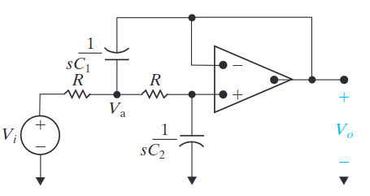

# First-Order Low-Pass and High-Pass Filters
It is possible to build low-pass and high-pass filters using an op-amp. Two main reasons for this are it allows you to create all 4 filters without using inductors (which are worse in many regards than capacitors), and the load ($V_o$) has minimal effect on the circuit. It also allows greater control over amplification of the output.

Below is the general circuit diagram of the op-amps used for high-pass and low-pass filters:

This means that our transfer function will be:
$$
H(s) = \frac{-Z_f}{Z_i}
$$

# Low-Pass Filter
## Circuit Diagram

## Low-Pass Transfer Function
By determining the impedance of $-Z_f$ and $Z_i$:
$$
H(s) = -K \frac{\omega_c}{s + \omega_c}
$$
Where 
$$
K = \frac{R_2}{R_1}
$$

## Low-Pass Cutoff Frequency
$$
\omega_c = \frac{1}{R_2 C}
$$

# High-Pass Filter
## Circuit Diagram

## High-Pass Transfer Function
$$
H(s) = -K \frac{s}{s + \omega_c}
$$
where
$$
K = \frac{R_2}{R_1}
$$

## High-Pass Cutoff Frequency
$$
\omega_c = \frac{1}{R_1 C}
$$

# Scaling
Scaling is an ==analysis== trick where you assume that all the circuit elements are equal to 1. Once the computation of the desired circuit properties is complete, it is possible to scale the circuit to different, more realistic values without changing the circuit's behaviour.

*Note that a filter where $R=1\Omega$, $C = 1 F$, $L = 1 H$ and $\omega_c = 1$ is know as a ==prototype filter==,* 

*Note it is entirely possible to ignore scaling and just perform computations with component values you can use.*

*Note it is possible to use scaling for ==passive filters== as well as active ones.*

There are two types of scaling;
- ==Frequency scaling==, denoted as $k_f$. During frequency scaling, all impedance stay at the same value (relative to the new frequency).
- ==Magnitude scaling==, denoted as $k_m$. Where all the impedance scale up by the same factor.

## Component Scaling
The equations to scale component values are:
$$
R^\prime = k_m R
$$
$$
L^\prime = \frac{k_m}{k_f} L
$$
$$
C^\prime = \frac{1}{k_f k_m} C
$$
Where $R^\prime$ are the values you are scaling to, and $R$ is the original value (often 1).

# Op-Amp Bandpass
By stringing together low-pass and high-pass circuits, it is possible to create bandpass and bandreject filters.

This circuit diagram is of a Bandpass filter:

## Bandpass Transfer Function
The transfer function is ==multiplication== of the transfer functions of the circuits which comprise it:
$$
H(s) = (\frac{- \omega_{c2}}{s + \omega_{c2}}) (\frac{- s}{s + \omega_{c1} })(\frac{-R_f}{R_i})
$$
$$
H(s) = \frac{-K \omega_{c2} s}{(s + \omega{c1}) (s + \omega_{c2})}
$$

*Note  $\omega_{c2}$ and $\omega_{c1}$ are assigned logically because we know that the high-pass will create the lower cutoff and the low-pass will create the higher cutoff.*

*Note this circuit is also a perfect demonstration of why the Laplace Transform is so useful in circuit analysis.*

# Op-Amp Bandreject Filter
To create a bandreject filter, we need to sum the Low-Pass filters and the High-Pass filters:

This creates the following circuit diagram:

# Assumptions for Bandreject and Bandpass Filters
Often when creating Bandreject and Bandpass Filters $\omega_{c2} >> \omega_{c1}$. If this is the case, we can ignore $omega_{c1}$ when finding the value of our low-pass filter and vice versa. 

This allows us to use the simple high-pass and low-pass equations for determining $\omega_c$:  
$$
\omega_{c2} = \frac{1}{R_L C_L}
$$
$$
\omega_{c1} = \frac{1}{R_H C_H}
$$
*While this is technically not correct, if there is a huge difference between the frequency cutoffs, the inaccuracy will be minimal.*

It is also possible to make a similar assumption when calculating the gain of the function so that"
$$
K = \frac{R_f}{R_i}
$$

# Cascading Identical Filters
Cascading identical filters is a method that can be used to cause sharper and ==sharper transitions== between the ==pass-band== and the ==stop-band==. Each time you cascade a filter, the order of the first increase by one ($1^{st}$ order becomes $2^{nd}$ and so on.)

## Transfer function
The scaling of the transfer function is:
$$
3^{rd}\text{ order } H(s) = (H(s))^3
$$

# Butterworth Filter
The Butterworth is a low-pass or high-pass filters that cascade more effectively than regular filters.

## Transfer function
$$
|H(j \omega) = \frac{1}{\sqrt{1 + (\omega / \omega_c)^{2n}}}
$$
*Where $n$ is the order of the filter.*

## Non-Cascading Butterworth Transfer function
If you just have a single butter worth filter, the transfer function is:
$$
H(s) = \frac{\frac{1}{R^2 C_1 C_2}}{s^2 + \frac{2}{RC_1}s + \frac{1}{R^2 C_1 C_2}}
$$
*This is derived by using KCL at node $V_a$ and $V_b$, and seeing $V_o = V_b$.*

Note that the ==gain== for this circuit is ==1==.
